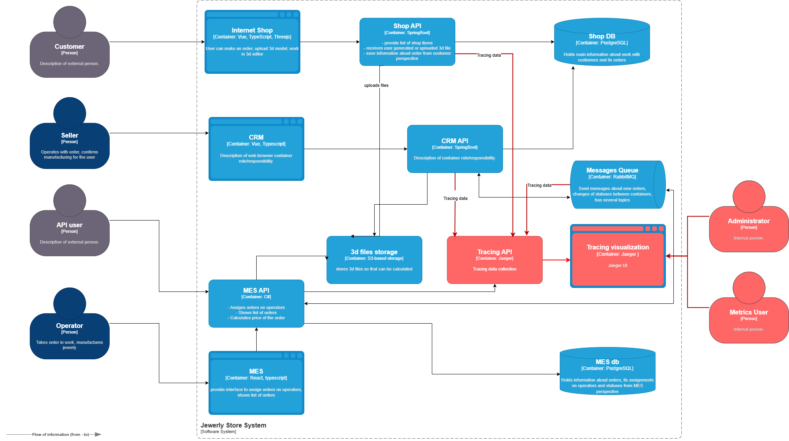

# Места, где заказ может "сломаться"

В теории заказ может сломаться в любом сервисе и на любом участке взаимодействия сервисов:

* В GUI
* В API
* DB (например, при сохранении или обнолении)
* Message Queue

Поэтому ввести трейсинг следуети везде. Однако, я не нашел средства, позволяющие выполнить трейсинг на входе или выходе из DB. GUI выполяется на стороне клиента, поэтому отследить его выход также представляется невозможным. Поэтому будем встраивать трейсинг внутри всех сервисов API и Message Queue:

* Shop API
* CRM API
* MES API
* Rabbit MQ

# Мотивация

Трейсинг позволит отследить путь заказа от получени запроса на его создание в MES API или Shop API. Это в свою очередь позволит выявить проблемные места, где заказ ломается: теряется, зависает и т.п.

Зная конкретное место: сервис, api, функцию, можно существенно снизить область поиска данных из логов для определения конкретной причины слома. Без трейсинга анализ логов займет значительно больше времени.

Используя метрики трейсинг можно управлять бизнес метриками: мерить и ставить реалистичные таргеты. Например:

* Response time в GUI и внешнем API:
  * Создание заказа.
  * Получения сообщения о цене заказа.
* SLA на обработку заказа операторами CRM и MES.
* SLA на получение сообщения о подтверждения заказа в GUI и внешнем API

Также можно аргументировать необходимость тех или иных технических доработок или покупки железа.

# Предлагаемое решение

Стек инструментов:

Jaeger со встроенной DB

Коллектор трейсов для RabbitMQ - [https://github.com/opentracing-contrib/java-spring-rabbitmq](https://github.com/opentracing-contrib/java-spring-rabbitmq)

# Компромиссы

Как было сказано в других блоках, трейсинг требует изменения кода сервисов. Учитывая загрузку команды и длительность релизов, данные инстурмент не следует внедреять в первую очередь. Сначала следует внедрить средства, не требующие изменения кода, и только потом трейсинг. Кроме трейсинга RabbitMQ, который можно настроить готовыми средствами.

В любом случае трейсинг стоит делать только после внедрерния мониторинга и логирования.

# Защита от НСД

Есть две точки входа в Jaeger:

1. API
2. GUI

## Защита GUI

### Идентификация и аутентификация

Доступ в UI должен быть по персональным кредам. Учетки должны соотвествовать доменным учеткам.

Доступ на редактирование должен быть только в Devops, ARCH и лида разработки.

Доступ на чтение у всей команды разработки, продукт менеджера. Остальным данные нужно выгружать.

### Защита канала

Взаимодействие по TLS. Минимум 1.2

Сертификат выписан у удостоверяющего центра.

## Защита API

### Защита канала

Взаимодействие с клиентами по TLS. Минимум 1.2

Сертификат выписан у удостоверяющего центра.

Аутентификация клиента и сервера по сертификату TLS.

### Firewall

Входящие: только порты, необходимые для сбора метрик и UI

Исходящие: полный доступ

### Защита хоста, периметра сети, аудит логов безопасности и т.п.

Вне скоупа данного предложения.
