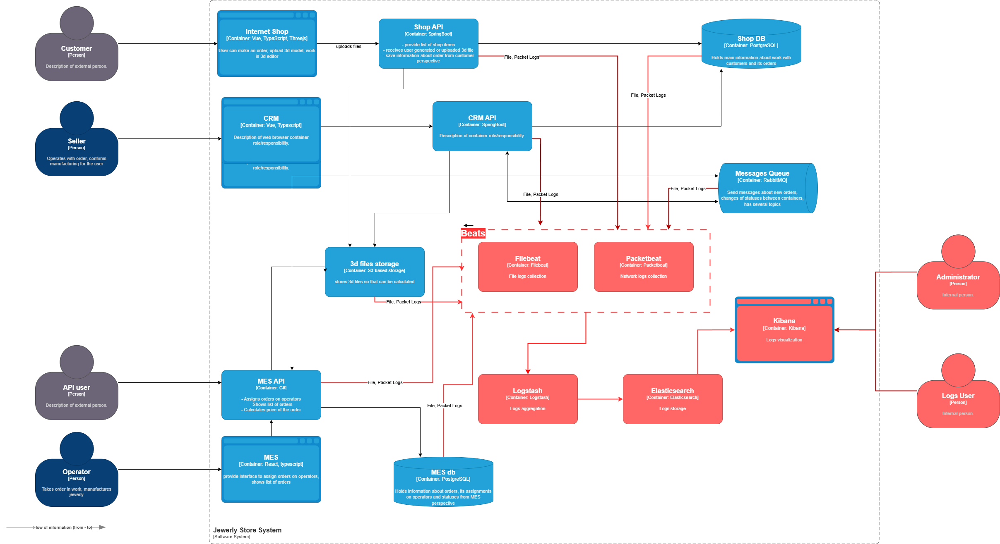

# Выбор логов

В идеале стоит логировать все доступные логи на каждом уровне абстракции: сеть, операционная система, сервер приложений, прикладной сервис.

Нас в первую очередь интересуют:

* логи прикладных сервисов: API, Message qeueu, DB, file storage.
* сетевые логи

## Логи прикладных сервисов

В идеале нужно собирать логи по вызову и выходу из каждого эндпоинта API:

* уровень INFO - корретный выход, возврат респонза
* уровень WARN - корретный выход, но из-за возникновения предвиденное ошибки (нулевой поинтер, нулевой сет данных из БД, нулевые данные и т.п)
* уровень ERROR - возникло исключение из-за непредвиденной ошибки

Логируем:

* ендпоинт
* время вызова, время выхода
* прикладыне данные: номер заказа, id пользователя, старое значение изменяемого поля, новое значение

На уровне WARN, ERROR дополнительно:

* условия выхода, исключения

Кроме того, предлагается логировать аварийное завершение сервиса на уровне FATAL. Это нужно будет логировать на уровне операционной системы или сервера приложений.

## Сетевые логи

Здесь стоит собирать все, что предоставляет готовы инструмернты. См. ниже.

Сетевые логи могут частично заменить трейсинг. Хотя бы на первое время.

# Мотивация

Само по себе логирование позводит выявить глубинные, конкретнеые причины возникновения проблем. Организация централизованного сбора, хранения и обработки логов позволит выполять анализ логов существенно быстрее, чем анализ локально на каждой машине.

Логирование предлагается внедрять в следующем приоритете:

1. MES API
2. CRM API
3. MES DB
4. SHOP API
5. Сетевые логи
6. Message queue.
7. S3 Storage
8. CRM DB
9. SHOP DB

Причины:

1. MES API торчит наружу.
2. MES API куплен на стороне и не проходит контроль качества и отладку в самое компании.
3. По самому сервису онлайн магазина жалоб нет. Проблема возникает где-то дальше.
4. Базы данных, шина данных и S3  - сторонние решения, качество которых было проверено соотвествующими вендорами. Можем считать, что оно тождественно идеальному. По крайне мере в первый год внедрения и отладки всей системы Observability.

# Предлагаемое решение

Для логирования предлагается использовать стек ELK.

В качестве агентов предлагается использовать утилиты семейства Beats: Filebeat и Packetbeat.

Схема логирования

## Политика безопасности

Политика безопаности определяется требования регуляторов той страны, в которой происходит обработка данных. Например, в Европе GDPR. Сет требований огромный, поэтому подробно рассматривать не будем. Отметим, что в любом случае нужны:

* Разграничение доступа по ролям.
* Доступ только по персонифицированным учетным записям. Учетки должны быть ассоциированы с конкртеным сотрудников компании.
* Анонимизация данных. В логах не должно быть ФИО, паспорт, адреса, кредитки и т.п.

## Политика хранения

Для каждого сервиса - отдельный индекс.

Для сетевых логов - отдельный индекс. Шардирование по дням.

Срок хранения логов - 1 месяц в Elastik. Логи долго хранить не нужно, так как они нужны для решение текущих проблем. Если инцидент не проанализирован за 1 мес, это говорит о нехватке ресурсов. И скорее всего инцидент не будет проанализирована никогда.

# Алертинг

За первые полгода предлагается не делать, так как алертинг итак будет на уровне мониторинга.

# Аномалии

* Резкое повышение количества запросов в единицу времени.
* Резкое повышение количества response с типом 500 в единицу времени.
* Резкое повышение количества записей с типом WARN или ERROR.
* Отсутствие логов выше установленного периода отправки логов в Elastik.
