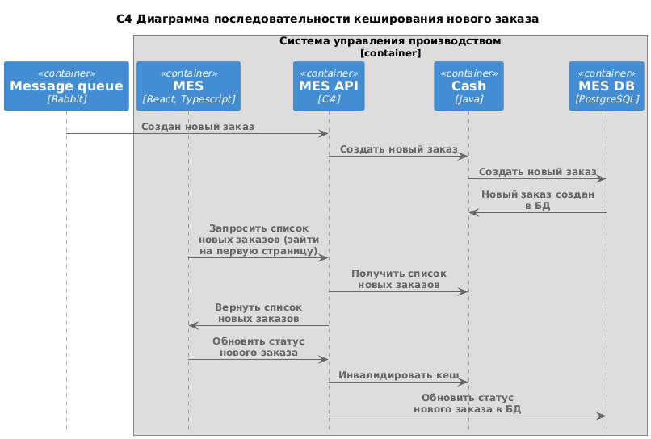

# Выбор сценария для кеширования и мотивация

В первую очередь кешировать предлагается новые заказы для отображения при первой загрузке веб-страницы в MES.

Причины:

1. Пользователи явно жалуются на меделенную прогрузку первой страницы.
2. Им в первую очередь интересуют новые заказы.

В будущем скорее всего понадобится кеширование заказов разных статусах. Но пока проблема только в отображении новых заказов, лучше потратиться только на нее.

Кеширование новых заказов позволит получать их без обращения к БД, что существенно ускорит их получени в API и передачу во фронт.

Однако, есть вероятность, что проблема не только в медленной работе БД.

Например, проблема может быть в контракте работы фронта и бека. Возможно фронт получает данные из бека не самым опмимальным путем. Например, для отображения фильтра фронт может запрашивать не первый чанк данных, а все. (Буквально на прошлой неделе обнаружили такое с тимлидом в своей команде).

Также проблема возможна при обработке результатов запрос в API MES или в неоптимальном составлении самого запроса, или перегрузке соединений к БД.

Оптимизация кода на этих уровнях может решить проблему без кеширования.

Поэтому будем исходить их того, что код разработан достаточно оптимально, и мощности самой СУБД достаточно.

# Предлагаемое решение

### Выбранное решение

Выбрано использовать Write-Through в комбинации с Read-Through. В этом случае при передачи нового заказа из Rabbit MES API сначала пишет его в кеш. Клиенты, запросившие чтение новых заказов сразу читают его из кеша. То есть кеш становится своего рода микро базой данных для новых заказов.

Здесь важно, чтобы заказ в кеше становился доступным для чтения только после записи в БД. Иначе есть риск расхождения даннных, если, например, заказ будет прочитан клиентом, а запись в БД не сработает.

Диаграмма последовательности кеширования

Так как сценарий кеширования очень специфичный, использовать стандартные инструмента, типа Redis, не получится. Нужно разработать свой. Принято решение разработать на Java.

#### Инвалидация кеша

Инвалидировать кеш нужно будет при первом обновлении статуса - назначении оператора.

### Рассмотренные варианты

Также можно использовать Refresh-Ahead на стороне MES API. Периодически подгружать в кеш новые заказы из БД. Тем не менее принято решение оставить первый вариант, так как:

* оно надежнее
* для Refresh-Ahead нужна качественная система мониторинга. Но пока она только внедряется и не отлажена. Люди не обрели практические навыки для работы с ней.

Клиентское кеширование здесь не подходит, так как оно направлено на кеширование редко меняющихся данных. Что предполагает, что данные уже созданы. Заказы же 0 это новые данные, которые фронт еще не получал.

Cache-Aside не подходит по тем же причинам.
